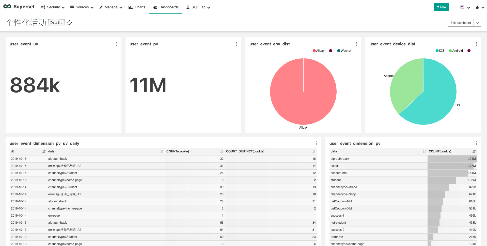
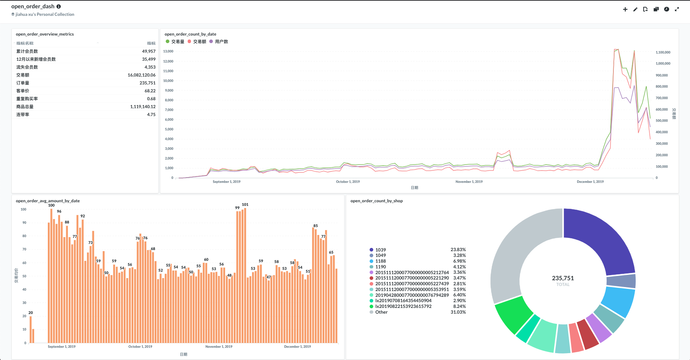

# 数据可视化（BI）

通过可视化数据，让数据的受众，更好地理解数据代表的含义。

## 工具

### BI产品

BI产品的功能不外乎如下：

1. 图表展示
2. Dashboard，图表组合
3. SQL Editor

#### 商业BI产品

1. Tableau
   1. 太贵。
2. PowerBI 
   1. 软件只有Windows版。用习惯了Mac，回不去Windows了。

#### 开源BI产品

1. Superset
   1. 查看源码发现，这是一个典型的Flask-AppBuilder项目，而`sqlalchemy` 这个ORM框架将支持多个SQL方言的功能覆盖了。不支持多表JOIN，可能很大程度是太依赖这个ORM框架了。
   2. 缺点：不支持多表JOIN，创建图表只能基于单表。workaround：分析之前创建大宽表。
   3. 缺点：SQL Editor中编译的SQL语句，没有直接渲染成图表的功能，更不能包含在某个dashboard中。
   4. 缺点：小bug多，影响用户体验。
2. Metabase
   1. 比起Superset更美观，产品完整度更高。
   2. 缺点：一维数组直方图显示的需求，无法满足（ref：[https://github.com/metabase/metabase/issues/798](https://github.com/metabase/metabase/issues/798)）。workaround：手写SQL分bin，成为二维数据，套用二维数据图表。

### 开发工具

#### JavaScript

1. ECharts
2. D3.js

#### Python

1. matplotlib
2. Dash/plotly

